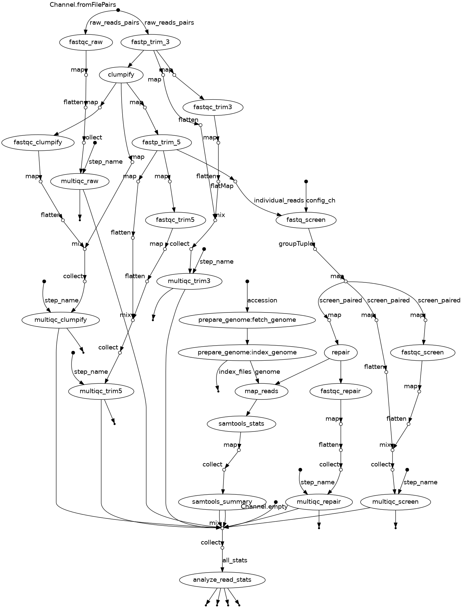

# GCL Illumina QC Pipeline



This pipeline processes demultiplexed Illumina paired-end reads through a series of quality control steps and outputs a set of high-quality reads aligned to a specified reference genome. Each step is modular and follows the [Nextflow DSL2](https://www.nextflow.io/docs/latest/dsl2.html) standard.

---

## 🔧 QC Steps

The following QC tools are integrated as modules in the pipeline:

1. **[fastp (3' trim)](https://github.com/OpenGene/fastp)** – Removes low-quality bases and trims Illumina adapters from the 3' end.
2. **[Clumpify](https://jgi.doe.gov/data-and-tools/bbtools/bb-tools-user-guide/clumpify/)** – De-duplicates reads and optimizes file structure for compression and alignment.
3. **[fastp (5' trim)](https://github.com/OpenGene/fastp)** – Trims polyG/polyX sequences and further filters reads at the 5' end.
4. **[FastQ Screen](https://www.bioinformatics.babraham.ac.uk/projects/fastq_screen/)** – Screens reads for contamination by mapping to multiple reference genomes.
5. **[BBMap Repair](https://jgi.doe.gov/data-and-tools/bbtools/bb-tools-user-guide/repair/)** – Ensures read pairing integrity after filtering.
6. **[FastQC](https://www.bioinformatics.babraham.ac.uk/projects/fastqc/)** – Quality check after each step to assess sequence quality, duplication levels, and adapter content.
7. **[MultiQC](https://multiqc.info/)** – Aggregates results from FastQC and other tools into a single report.
8. **[NCBI Datasets CLI](https://www.ncbi.nlm.nih.gov/datasets/docs/v2/)** – Downloads reference genomes by accession number.
9. **[BWA-MEM2](https://github.com/bwa-mem2/bwa-mem2)** – Aligns reads to the reference genome.
10. **[SAMtools](http://www.htslib.org/)** – Summarizes mapping statistics (`samtools stats` and `flagstat`).

---

## 📁 Expected Directory Structure

Clone this repository into a project folder structured like this:

```
📁 project-root/
├── 📁 gcl_illumina_qc/               # ✅ Must be present (cloned repo)
│   ├── 📄 main.nf
│   ├── 📄 nextflow.config
│   ├── 📄 README.md
│   ├── 📄 run_qc.sbatch
│   └── 📁 modules/
│       ├── clumpify.nf
│       ├── fastp_trim_3.nf
│       ├── fastp_trim_5.nf
│       ├── fastq_screen.nf
│       ├── fetch_genome.nf
│       ├── index_genome.nf
│       ├── map_reads.nf
│       ├── multiqc.nf
│       ├── repair.nf
│       ├── fastqc.nf
│       ├── samtools_stats.nf
│       ├── samtools_summary.nf
│       └── analyze_read_stats.nf
├── 📁 data/
│   ├── 📁 fq_raw/                    # ✅ Must be present (input FASTQ files)
│   ├── 📁 fq_fp1_clmp_fp2_scrn_rpr/         # 🚀 Created by pipeline
│   ├── 📁 bam/     					      # 🚀 Created by pipeline
│   └── ... (other subfolders by step)       # 🚀 Created by pipeline
├── 📁 genome/                        # 🚀 Created by pipeline (genome + index)
├── 📁 logs/                          # 🚀 Created by pipeline (SLURM + Nextflow logs)
└── 📁 results/
    └── 📁 multiqc/                   # 🚀 Created by pipeline (MultiQC reports)
```

---

## 🚀 Running the Pipeline

### Option 1: Local/Interactive Run

```bash
# Load environment and activate nextflow
module load miniconda3
source activate nextflow

# Run pipeline with example inputs
nextflow run gcl_illumina_qc/main.nf     -profile standard     -resume     --reads "data/fq_raw/*.{1,2}.fq.gz"     --accession "GCA_042920385.1"     --decontam_conffile "configs/contam_db.conf"     --outdir "results"

# Optional: visualize DAG
nextflow run gcl_illumina_qc/main.nf -with-dag flowchart.dot
dot -Tpng flowchart.dot -o flowchart.png
```

### Option 2: SLURM Submission

```bash
sbatch run_qc.sbatch
```

Edit `gcl_illumina_qc/run_qc.sbatch` to customize resources used by orchestra conductor job (e.g., CPUs, memory, partition).
Edit `gcl_illumina_qc/nextflow.config` to customize resources used by each QC stage (e.g., CPUs, memory, partition).
---

## 📊 Post-Pipeline QC Analysis

The final step of the pipeline summarizes alignment and quality metrics across all samples. This includes:

- **Read Retention Statistics** – Compiled at each QC step (via `analyze_read_stats.nf`).
- **Mapping Metrics** – Generated using `samtools flagstat` and `samtools stats`.
- **MultiQC** – Integrates all FastQC, fastp, and mapping metrics into one HTML report (`results/multiqc/`).

These reports help evaluate the effectiveness of each filtering and trimming step, ensuring high-quality downstream analyses.

---

## 💡 Notes

- Each module runs independently with `publishDir` to maintain organized outputs.
- The pipeline can be extended with additional modules (e.g., variant calling or quantification).
- Uses Conda environments (no containers required by default).
- If job is interupted prior to finishing the full pipeline it can be resumed from where it was interupted with the same command that started the run
- After satisfactory completion the `./work` directory can be deleted to free-up disk-space. The sub-folders in `./data/fq_fp1*` can also be removed as intermediate files.

---

## 📬 Contact

For questions or feedback, contact Jason Selwyn — [jason.selwyn@tamucc.edu](mailto:jason.selwyn@tamucc.edu)
